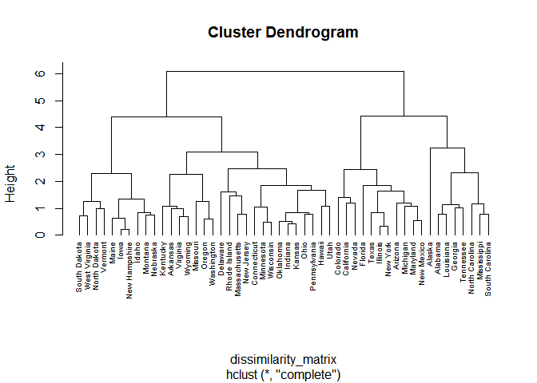
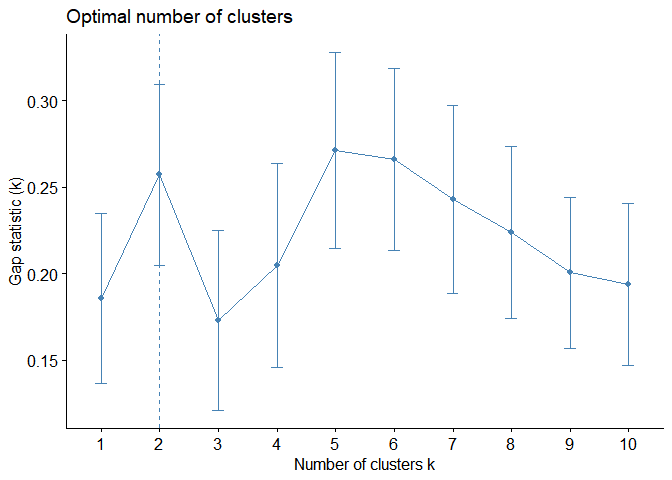

P8451 Machine Learning in Public Health - Assignment 4
================
2023-2-14

In preparation for all the analyses below, we will load the following
libraries:

``` r
library(caret)
```

    ## Loading required package: ggplot2

    ## Loading required package: lattice

``` r
library(tidyverse)
```

    ## ── Attaching packages ─────────────────────────────────────── tidyverse 1.3.2
    ## ──

    ## ✔ tibble  3.1.8     ✔ dplyr   1.1.0
    ## ✔ tidyr   1.3.0     ✔ stringr 1.5.0
    ## ✔ readr   2.1.4     ✔ forcats 1.0.0
    ## ✔ purrr   1.0.1     
    ## ── Conflicts ────────────────────────────────────────── tidyverse_conflicts() ──
    ## ✖ dplyr::filter() masks stats::filter()
    ## ✖ dplyr::lag()    masks stats::lag()
    ## ✖ purrr::lift()   masks caret::lift()

``` r
library(dplyr)
library(stats)
library(factoextra)
```

    ## Welcome! Want to learn more? See two factoextra-related books at https://goo.gl/ve3WBa

``` r
library(cluster)
library(ggpubr)
```

# Part 0: Data Preprocessing

## Data Import and Cleaning

We will begin by importing the general health and physical activity data
collected by the **New York City Department of Health** using the
`read_csv` function. Next, we will clean the data by first applying the
`clean_names` function, then applying the `mutate` function to generate
variables with more representative variable names. All variables are
initially imported as numeric variables. According to the data codebook
provided, the following variables are factor variables with anywhere
between 2 to 6 levels:

- `hypertension` (chronic1)
- `diabetes` (chronic3)
- `asthma` (chornic4)
- `smoking` (tobacco1)
- `alcohol` (alcohol1)
- `physical_activity_minutes` (gpaq8totmin)
- `diet_cat` (habits5)
- `age_cat` (agegroup)
- `sex` (dem3)
- `hispanic` (dem4)
- `born_in_US` (dem8)
- `poverty_group` (povertygroup)

Finally, using the `select` function, we select only the newly labeled
variables, remove entries with NA using `na.omit`, and remove any
duplicate ID entries using the `distinct` function.

``` r
nyc_health = read_csv("./class4_p1.csv") %>% 
  janitor::clean_names() %>% 
  mutate(id = x1, 
         hypertension = factor(chronic1, labels = c("Yes", "No")),
         diabetes = factor(chronic3, labels = c("Yes, No")), 
         asthma = factor(chronic4, labels = c("Yes", "No")), 
         smoking = factor(tobacco1, labels = c("Most or All Days", 
                                               "Some Days", 
                                               "Never")), 
         alcohol = factor(alcohol1, labels = c("Most or All Days", 
                                               "Some Days", 
                                               "Never")), 
         physical_activity_minutes = gpaq8totmin, 
         walk_days = gpaq11days, 
         physical_activity_cat = factor(habits5, labels = c("Very Active", 
                                                            "Somewhat Active", 
                                                            "Not Very Active", 
                                                            "Not Active At All")), 
         diet_cat = factor(habits7, labels = c("Excellent",
                                               "Very Good", 
                                               "Good", 
                                               "Fair", 
                                               "Poor")), 
         age_cat = factor(agegroup, labels = c("18-24 Yrs", 
                                               "25-44 Yrs", 
                                               "45-64 Yrs", 
                                               "65+")), 
         sex = factor(dem3, labels = c("Male", "Female")), 
         hispanic = factor(dem4, labels = c("Yes", "No")), 
         born_in_US = factor(dem8, labels = c("USA", "Outside USA")), 
         poverty_group = factor(povertygroup, labels = c("<100%", 
                                                         "100-199%", 
                                                         "200-399%", 
                                                         "400-599%", 
                                                         "600% +", 
                                                         "Don't Know")), 
         healthy_days = healthydays) %>% 
  select(id, hypertension, diabetes, asthma, bmi, smoking, alcohol, 
         physical_activity_minutes, walk_days, physical_activity_cat, diet_cat, 
         age_cat, sex, hispanic, born_in_US, poverty_group, healthy_days) %>% 
  na.omit() %>% 
  distinct(id, .keep_all = TRUE)
```

    ## New names:
    ## Rows: 3811 Columns: 17
    ## ── Column specification
    ## ──────────────────────────────────────────────────────── Delimiter: "," dbl
    ## (17): ...1, chronic1, chronic3, chronic4, bmi, tobacco1, alcohol1, gpaq8...
    ## ℹ Use `spec()` to retrieve the full column specification for this data. ℹ
    ## Specify the column types or set `show_col_types = FALSE` to quiet this message.
    ## • `` -> `...1`

## Feature Selection: Identifying and Removing Correlated Predictors

Many machine learning algorithms are unable to differentiate between
highly correlated features. As such, we want to identify highly
correlated features that present the same mathematical information and
subsequently remove them, to avoid introducing error in our approach.

To complete this feature selection process, we will first select only
the numeric variables in our `nyc_health` data set, since correlations
can only be assessed with numeric variables. We will then apply the
`cor` function that will calculate correlations. These calculated
correlations will then be fed into the `findCorrelation` function with a
cutoff of **0.4**. The features that correlated at 0.4 and above will be
stored in a new objected labeled as `high_correlations`.

``` r
nyc_health_numeric = nyc_health %>% 
  select(where(is.numeric)) 

correlations = cor(nyc_health_numeric, use = "complete.obs")

high_correlations = findCorrelation(correlations, cutoff = 0.4)
```

Since there are no values in the `high_correlations` object, we can
conclude that there are no highly correlated variables in these data.

## Centering and Scaling

Below, we center and scale these data. In general, it is always good
practice to do so!

``` r
preprocess_setup <- preProcess(nyc_health_numeric, method = c("center", "scale"))
transformed.vals = predict(preprocess_setup, nyc_health_numeric)
```

## Partitioning Data

For the purposes of this analysis, we will partition the data into
training and testing using a 70/30 split. This process involves applying
the `createDataPartition` function to generate a set of training and
testing data with equal proportion of individual with the outcome of
interest, i.e., `healthy_days`. The new object `train_index` contains
all the indexes of the rows in the original data set contained in the
70% split. The rows indexed to be in the 70% is assigned to a new
training data set, and the remaining 30% is assigned to a new testing
data set.

``` r
train_index = createDataPartition(nyc_health$healthy_days, p = 0.7, list = FALSE)

nyc_health_train <- nyc_health[train_index,]
nyc_health_test <- nyc_health[-train_index,]
```

# Part I: Implementing a Simple Prediction Pipeline

## Question 1: Fitting Prediction Models

Below, we will fit two prediction models with linear regression to
preidct the number of days in a month an individual reported having good
physical health (i.e., variable `healthy_days`).

### 1.1 Model 1: Demographics + Medical Conditions

In the first model, **`healthy_days_model_1`**, we include features
containing basic demographic information, as well as those containing
medical information. The features included in this model are as follows:

- `sex`
- `age_cat`
- `hispanic`
- `born_in_US`
- `poverty_group`
- `bmi`
- `hypertension`
- `diabetes`
- `asthma`

In the code chunk below, we will use the `trainControl` function to set
our validation method. For the purposes of this analysis, we will use
the 10-fold cross validation method.

``` r
control.settings = 
  trainControl(method = "cv", number = 10)
```

These control settings can now be applied within the `train` function,
which will be used to implement our algorithms. We also apply a tuning
grid for lambda and alpha in order to generate the lambda and alpha
values that minimizes the RMSE, and therefore the best model. The
parameters of the grid search (i.e., the values of alpha and lambda)
were determined by first running a rough grid search, then narrowing
down the range of values to yield more precise values.

``` r
alpha = seq(0, 1, length = 20)
lambda = seq(0, 0.2, length = 20)
lambda_grid = expand.grid(alpha = alpha, lambda = lambda)

set.seed(123)
healthy_days_model_1 = 
  train(healthy_days ~ sex + age_cat + hispanic + born_in_US + poverty_group + bmi + hypertension + diabetes + asthma, data = nyc_health_train, method = "glmnet", preProc = c("center", "scale"), trControl = control.settings, tuneGrid = lambda_grid)

healthy_days_model_1$bestTune
```

    ##    alpha lambda
    ## 20     0    0.2

### 1.2 Model 2: Demographics + Self-Reported Data

In the second model, **`healthy_days_model_2`**, we include the same
features containing basic demographic information, as well as
self-reported data regarding smoking and alcohol consumption, levels of
physical activity, and diet. The features included in this model are as
follows:

- `sex`
- `age_cat`
- `hispanic`
- `born_in_US`
- `poverty_group`
- `smoking`
- `alcohol`
- `physical_activity_minutes`
- `walk_days`
- `physical_activity_cat`
- `diet_cat`

Replicating the approach applied to train the first model above, we will
apply the same control settings to the `train` function. We also apply a
tuning grid again for lambda and alpha in order to generate the lambda
and alpha values that minimizes the RMSE, and therefore the best model.

``` r
alpha = seq(0.9, 1, length = 20)
lambda = seq(0, 0.1, length = 20)
lambda_grid = expand.grid(alpha = alpha, lambda = lambda)

set.seed(123)
healthy_days_model_2 = 
  train(healthy_days ~ sex + age_cat + hispanic + born_in_US + poverty_group + smoking + alcohol + physical_activity_minutes + walk_days + physical_activity_cat + diet_cat, data = nyc_health_train, method = "glmnet", preProc = c("center", "scale"), trControl = control.settings, tuneGrid = lambda_grid)

healthy_days_model_2$bestTune
```

    ##         alpha     lambda
    ## 347 0.9894737 0.03157895

## Question 2: Applying Prediction Models Within Test Data

After producing the two trained models above, we can proceed with model
evaluation by first applying the prediction models within test data
using the `predict` function. We then generate a function that
calculates the RMSE, with the model testing outcomes set as the
actual/observed values, and the original testing data as the expected
values.

### 2.1 Prediction Model 1 Evaluation

Below we apply the aforementioned steps to evaluate
`healthy_days_model_1`.

``` r
test_outcome_model_1 = predict(healthy_days_model_1, nyc_health_test)

rmse = function(actual, expected) {
  residuals = actual - expected
  sqrt(mean(residuals^2))
}

rmse(test_outcome_model_1, nyc_health_test$healthy_days)
```

    ## [1] 7.195229

### 2.2 Prediction Model 2 Evaluation

Below we apply the above mentioned steps to evaluate
`healthy_days_model_2`.

``` r
test_outcome_model_2 = predict(healthy_days_model_2, nyc_health_test)

rmse = function(actual, expected) {
  residuals = actual - expected
  sqrt(mean(residuals^2))
}

rmse(test_outcome_model_2, nyc_health_test$healthy_days)
```

    ## [1] 7.018583

Since the RMSE is minimized in `healthy_days_model_2`, we can conclude
that **`healthy_days_model_2` is the preferred prediction model**.

## Question 3: Discussion of Useful Implementation of Final Model

The features in `healthy_days_model_2` contain mostly self-reported
data, which contrasts the some features included in
`healthy_days_model_1`, which contains information on medical history.
An application of `healthy_days_model_2` may be useful when access to
data is limited to qualitative data collected through population
surveys. In instances where individual medical history is not able to be
ascertained, self-reported data can still be used to predict the number
of days in a month an individual reports having good physical health.

# Part II: Conducting an Unsupervised Analysis

For the purposes of this analysis, we will be using the built-in R data
set **USArrests**, which includes the crime statistics for each of the
50 U.S. states in 1973. We can apply the `skim` function to generate
general descriptive statistics for the data set.

``` r
us_arrests = USArrests
skimr::skim(us_arrests)
```

|                                                  |            |
|:-------------------------------------------------|:-----------|
| Name                                             | us_arrests |
| Number of rows                                   | 50         |
| Number of columns                                | 4          |
| \_\_\_\_\_\_\_\_\_\_\_\_\_\_\_\_\_\_\_\_\_\_\_   |            |
| Column type frequency:                           |            |
| numeric                                          | 4          |
| \_\_\_\_\_\_\_\_\_\_\_\_\_\_\_\_\_\_\_\_\_\_\_\_ |            |
| Group variables                                  | None       |

Data summary

**Variable type: numeric**

| skim_variable | n_missing | complete_rate |   mean |    sd |   p0 |    p25 |    p50 |    p75 |  p100 | hist  |
|:--------------|----------:|--------------:|-------:|------:|-----:|-------:|-------:|-------:|------:|:------|
| Murder        |         0 |             1 |   7.79 |  4.36 |  0.8 |   4.08 |   7.25 |  11.25 |  17.4 | ▇▇▅▅▃ |
| Assault       |         0 |             1 | 170.76 | 83.34 | 45.0 | 109.00 | 159.00 | 249.00 | 337.0 | ▆▇▃▅▃ |
| UrbanPop      |         0 |             1 |  65.54 | 14.47 | 32.0 |  54.50 |  66.00 |  77.75 |  91.0 | ▁▆▇▅▆ |
| Rape          |         0 |             1 |  21.23 |  9.37 |  7.3 |  15.08 |  20.10 |  26.17 |  46.0 | ▆▇▅▂▂ |

The `us_arrests` data set contains **50 rows** and **4 columns**. Each
row corresponds to a U.S. state, and each column contains the following
state-specific data:

- Murder arrests per 100,000 population
- Assault arrests per 100,000 population
- Percent urban population
- Rape arrests per 100,000 population

There are **0 missing values** in these data.

## Question 4: Hierarchical Cluster Analysis

### 4.1 Assessing Need for Scaling

First, we will obtain and compare the means and standard deviations
across all features by applying the `colMeans` function.

``` r
us_arrests_features = us_arrests %>% 
  select(Murder, Assault, UrbanPop, Rape)
  
colMeans(us_arrests_features, na.rm = TRUE)
```

    ##   Murder  Assault UrbanPop     Rape 
    ##    7.788  170.760   65.540   21.232

``` r
apply(us_arrests_features, 2, sd, na.rm = TRUE)
```

    ##    Murder   Assault  UrbanPop      Rape 
    ##  4.355510 83.337661 14.474763  9.366385

There are significant differences in the means and standard deviations
across the features. It would be most appropriate, therefore, to proceed
with centering and scaling these data. To center and scale these data,
we will apply the `prcomp` function.

``` r
us_arrests_features_scaled = 
  prcomp( ~ ., data = us_arrests_features, center = TRUE, scale = TRUE, na.action = na.omit)
```

### 4.2 Conducting Hierarchical Clustering Analysis

Below, we first create a dissimilarity matrix by applying the `dist`
function. The `us_arrests_scaled` data frame is inputted into the
function, and the Euclidean distance calculation method is entered as
directed. The complete linkage method is applied as well. After creating
the dissimilarity matrix, we will then use the `plot` function to
generate the obtained dendrogram.

``` r
dissimilarity_matrix = dist(us_arrests_features_scaled$x, method = "euclidean")

clusters_h = hclust(dissimilarity_matrix, method = "complete" )

plot(clusters_h, cex = 0.6, hang = -1)
```

<!-- -->

There is now a decision point regarding where in the height we draw the
line to determine the optimal number of clusters. To make this decision,
we will use the gap statistic.

``` r
hclusCut = function(x, k) list(cluster = cutree(hclust(dist(x, method = "euclidian"), method = "average"), k = k))

gap_stat = clusGap(us_arrests_features_scaled$x, FUN = hclusCut, K.max = 10, B = 50)
fviz_gap_stat(gap_stat)
```

<!-- -->

Based on the output above, we can conclude that the **optimal number of
clusters is 5**, since the gap statistic is maximized at k = 5. Using
this information, we can obtain the cluster assignment for each of the
50 states. Finally, we can generate summary-level data to describe the
composition of each cluster in terms of the original input features.

``` r
clusters_h_5 = cutree(clusters_h, k = 5)

table(clusters_h_5)
```

    ## clusters_h_5
    ##  1  2  3  4  5 
    ##  7  1 11 21 10

``` r
aggregate(us_arrests_features, by = list(cluster = clusters_h_5), mean)
```

    ##   cluster    Murder  Assault UrbanPop     Rape
    ## 1       1 14.671429 251.2857 54.28571 21.68571
    ## 2       2 10.000000 263.0000 48.00000 44.50000
    ## 3       3 11.054545 264.0909 79.09091 32.61818
    ## 4       4  5.871429 134.4762 70.76190 18.58095
    ## 5       5  3.180000  78.7000 49.30000 11.63000

Descriptions of the compositions of each cluster in terms of the
original input features, and how each cluster compares to the other
clusters in terms of the original input features are as follows:

**Cluster 1**

- Mean number of murder arrests per 100,000 population = 14.67 (Highest)
- Mean number of assault arrests per 100,000 population = 251.29 (3rd
  Highest)
- Percent urban population = 54.29% (3rd Highest)
- Mean number of rape arrests per 100,000 population = 21.69 (3rd
  Highest)

**Cluster 2**

- Mean number of murder arrests per 100,000 population = 10.00 (3rd
  Highest)
- Mean number of assault arrests per 100,000 population = 263.00 (2nd
  Highest)
- Percent urban population = 48.00% (Lowest)
- Mean number of rape arrests per 100,000 population = 44.50 (Highest)

**Cluster 3**

- Mean number of murder arrests per 100,000 population = 11.05 (2nd
  Highest)
- Mean number of assault arrests per 100,000 population = 264.09
  (Highest)
- Percent urban population = 79.09% (Highest)
- Mean number of rape arrests per 100,000 population = 32.62 (2nd
  Highest)

**Cluster 4**

- Mean number of murder arrests per 100,000 population = 5.87 (2nd
  Lowest)
- Mean number of assault arrests per 100,000 population = 134.48 (2nd
  Lowest)
- Percent urban population = 70.76% (2nd Highest)
- Mean number of rape arrests per 100,000 population = 18.58 (2nd
  Lowest)

**Cluster 5**

- Mean number of murder arrests per 100,000 population = 3.18 (Lowest)
- Mean number of assault arrests per 100,000 population = 78.70 (Lowest)
- Percent urban population = 49.30% (2nd Lowest)
- Mean number of rape arrests per 100,000 population = 11.63 (Lowest)

## Question 5: A Research Application of the Newly Identified Clusters
